# WorldIT Social Network


Цей проєкт був нашим дипломним, і основною метою його створення було продемонструвати набуті знання та практичні навички, отримані протягом навчання. Він був корисним насамперед для нас самих — у процесі роботи ми поглибили свої знання, навчилися працювати в команді, вирішувати практичні завдання та готувати повноцінний продукт.

## Используемые технологии и стек

При разработке данного приложения были использованы такие языки программирования, фреймфорки, базы данных и библиотеки как:

- Название
- Название
- Название
- Название
- Название
- Название

## Figma

(Вставьте сюда свою ссылку на файл фигмы с дизайном)

## Как установить проект локально?

1. Склонируйте репозиторий, скопировав ссылку.
2. Создайте новый терминал.
3. Установите зависимости с помощью команды:
```
npm install
```
Ее необходимо ввести в строку терминала.
4. Запустите проект, введя в строку в терминале команду:
```
npm run start
```
5. (Если вдруг необъодимо установить какие-то настройк, подключение к API или базе данных)

## Структура проекта

```mermaid
graph TD
        Main[Chit-Chat-Back-End]-->
            Prisma[prisma]-->
                DataBase[db]-->Database.db
            Prisma[prisma]--> 
                Migrations[migrations]--> 2734923u590
                Migrations[migrations]--> migration_lock.toml

            Prisma[prisma]--> 
                Schema[schema]--> album.prisma
                Schema[schema]--> chats.prisma
                Schema[schema]--> friendship.prisma
                Schema[schema]--> images.prisma
                Schema[schema]--> post.prisma
                Schema[schema]--> user.prisma

            Prisma[prisma]--> schema.prisma
            Prisma[prisma]--> seed.ts

        Main[Chit-Chat-Back-End]-->
            Src[src]-->
                Chats[Chats]--> chat.controller.ts
                Chats[Chats]--> chat.repository.ts
                Chats[Chats]--> chat.router.ts
                Chats[Chats]--> chat.sevrice.ts
                Chats[Chats]--> chat.socket.controller.ts

            Src[src]-->
                Messages[Messages]--> message.controller.ts
                Messages[Messages]--> message.router.ts
                Messages[Messages]--> message.service.ts
                Messages[Messages]--> message.type.ts
                Messages[Messages]--> messages.repository.ts

            Src[src]-->
                albumApp[albumApp]--> albumController.ts

            Src[src]-->client[client]-->prismaClient.ts

            Src[src]-->
                config[config]-->errorCodes.ts
                config[config]-->token.ts

            Src[src]-->
                friendshipApp[friendshipApp]-->friendshipController.ts
                friendshipApp[friendshipApp]-->friendshipRepository.ts
                friendshipApp[friendshipApp]-->friendshipRouter.ts
                friendshipApp[friendshipApp]-->friendshipService.ts
                friendshipApp[friendshipApp]-->types.ts

            Src[src]-->
                generated[generated]-->prisma

            Src[src]-->
                middlewares[middlewares]--> authTokenMiddleware.ts
                middlewares[middlewares]--> socketAuthMiddleware.ts

            Src[src]-->
                postApp[postApp]--> postController.ts
                postApp[postApp]--> postRepository.ts
                postApp[postApp]--> postRouter.ts
                postApp[postApp]--> postService.ts
                postApp[postApp]--> types.ts

            Src[src]-->
                types[types]--> socket.ts
                types[types]--> types.ts

            Src[src]-->
                userApp[userApp]--> types.ts
                userApp[userApp]--> userController.ts
                userApp[userApp]--> userRepository.ts
                userApp[userApp]--> userRouter.ts
                userApp[userApp]--> userService.ts

            Src[src]-->index.ts

            Src[src]-->socket.ts

        Main[Chit-Chat-Back-End]-->Utils[utils]-->fileUtils.ts

        Main[Chit-Chat-Back-End]-->Gitignore[.gitignore]

        Main[Chit-Chat-Back-End]-->Prittier[.prettierrc]

        Main[Chit-Chat-Back-End]-->PackageLock[package-lock.json]

        Main[Chit-Chat-Back-End]-->Package[package.json]

        Main[Chit-Chat-Back-End]-->Tscofig[tsconfig.json]
```

```mermaid
graph TD
        Main[Chit-Chat-Back-End]-->
            Src[src]-->
                App[app]-->   
                    auth[(auth)]-->
                        registration[registration]

                    auth[(auth)]--> _layout.tsx

                App[app]-->
                    chats[chats]--> _laуout.tsx
                    chats[chats]--> chat.tsx

                App[app]--> 
                    friends[(friends)]--> _lаyout.tsx
                    friends[(friends)]--> friends-profile.tsx

                App[app]-->
                    main[(main)]--> _lауout.tsx

                App[app]-->
                    settings[(setting)]--> _lауout.tsх

                App[app]-->
                    tabs[(tabs)]--> layout[_lауout.tsx]
                    tabs[(tabs)]--> chats.tsx
                    tabs[(tabs)]--> friends.tsx
                    tabs[(tabs)]--> home.tsx
                    tabs[(tabs)]--> my-publications.tsx
                    tabs[(tabs)]--> settings.tsx
                    tabs[(tabs)]--> styles.ts

                App[app]--> Layout2[_layout.tsx]
                App[app]--> index.tsx
                App[app]--> providers.tsx

            Src[src]--> 
                modules[modules]-->
                    albums[albums]--> hooks--> useAlbums.tsx

                modules[modules]--> 
                    albums[albums]--> types--> albums.types.ts

                modules[modules]-->
                    albums[albums]--> 
                        ui[ui]--> 
                            add-album-modal[add-album-modal]

                        ui[ui]-->
                            album-header[album-header]-->
                                album-header.tsx

                        ui[ui]-->
                            album-modal[album-modal]-->
                                album-modal.tsx

                        ui[ui]-->
                            album[album]-->
                                album.style.ts
                            album[album]-->
                                album.tsx

                        ui[ui]-->
                            edit-album-modal[edit-album-modal]-->
                                edit-album-modal.style.ts
                            edit-album-modal[edit-album-modal]-->
                                edit-album-modal.tsx

                        ui[ui]-->
                            my[my]

                        ui[ui]-->
                            no-albums[no-albums]-->


                modules[modules]-->
                    auth[auth]-->
                        authContext[context]-->
                            types.ts
                        authContext[context]-->
                            user-context.tsx

                    auth[auth]-->
                        authHooks[hooks]-->
                            useCode.ts

                    auth[auth]-->
                        types[types]-->
                            indeх.ts
                        types[types]-->
                            register.ts
                        types[types]-->
                            user.ts
                            auth[auth]-->
                            
                        ui2[ui]-->
                            login-form-one[login-form-one]

                        ui2[ui]-->
                            reg-form-one[reg-form-one]

                        ui2[ui]-->
                            reg-form-three[reg-form-three]

                        ui2[ui]-->
                            reg-form-two[reg-form-two]

                        ui2[ui]-->
                            index7[index.ts]
                
                modules[modules]-->
                    chat[chat]-->
                        chatContext[context]
                    
                    chat[chat]-->
                        chatHooks[hooks]

                    chat[chat]-->
                        chatTypes[types]-->
                            socket.ts

                    chat[chat]-->
                        chatUi[ui]-->
                            chat-header[chat-header]
                        
                        chatUi[ui]-->
                            chatGroup[chatGroup]

                        chatUi[ui]-->
                            contacts[contacts]

                        chatUi[ui]-->
                            friend1[friend1]

                        chatUi[ui]-->
                            friend2[friend2]

                        chatUi[ui]-->
                            group-chats[group-chats]

                        chatUi[ui]-->
                            messagess[messagess]

                        chatUi[ui]-->
                            modals[modals]

                        chatUi[ui]-->
                            search[search]

                modules[modules]-->
                    friends[friends]-->
                        friendsHook[hooks]
                    
                    friends[friends]-->
                        friendsTypes[types]

                    friends[friends]-->
                        friendsUi[ui]--> all
                        friendsUi[ui]--> friends-profile
                        friendsUi[ui]--> friends-form
                        friendsUi[ui]--> friends-header
                        friendsUi[ui]--> recomend
                        friendsUi[ui]--> requests
                
                modules[modules]-->
                    home[home]--> register-step-two
                    home[home]--> homepage.styles.ts
                    home[home]--> homepage.tsx

                modules[modules]-->
                    my-pyblications[my-pyblications]--> modal
                    my-pyblications[my-pyblications]--> my-pyblications.tsx

                modules[modules]-->
                    post[post]--> hooks
                    post[post]--> types
                    post[post]--> 
                        postUi[postUi]--> author
                        postUi[postUi]--> change-post
                        postUi[postUi]--> content
                        postUi[postUi]--> main-page
                        postUi[postUi]--> modal-post

                modules[modules]-->
                    settings[settings]--> signature
                    settings[settings]-->index.ts
                    settings[settings]--> settings.styles.ts
                    settings[settings]--> settings.tsx


            Src[src]-->settings1234[settings]


        Main[WorldItSocialNetwork]-->README.md

        Main[WorldItSocialNetwork]-->app.json

        Main[WorldItSocialNetwork]-->index.ts

        Main[WorldItSocialNetwork]-->

        Main[WorldItSocialNetwork]-->Gitignore[.gitignore]

        Main[WorldItSocialNetwork]-->Prittier[.prettierrc]

        Main[WorldItSocialNetwork]-->PackageLock[package-lock.json]

        Main[WorldItSocialNetwork]-->Package[package.json]

        Main[WorldItSocialNetwork]-->Tscofig[tsconfig.json]
```




```

WorldItSocialNetWork
Соціальна мережа, створена з використанням Node.js (бекенд) та React Native (фронтенд). База даних — SQLite. API працює на http://localhost:3000.
6. Розгортання проєкту на локальному ПК
Для Windows

Встановлення необхідного ПЗ:

Завантажте та встановіть Git із git-scm.com (налаштування за замовчуванням).
Завантажте Node.js (LTS, наприклад, 18.x) із nodejs.org. Перевірте:node --version
npm --version


Встановіть Visual Studio Code (рекомендується).
SQLite не потребує окремого встановлення (вбудовано в sqlite3).


Клонування репозиторію:
cd C:\path\to\your\folder
git clone https://github.com/username/WorldItSocialNetWork.git
cd WorldItSocialNetWork


Встановлення залежностей:

Для бекенду:cd backend
npm install


Для фронтенду:cd ../frontend
npm install


Налаштування змінних середовища:

Створіть файл .env у папці backend:DB_PATH=./database/socialnet.db
JWT_SECRET=your-secret-key
PORT=3000


Перевірка:

Переконайтеся, що файл socialnet.db створено або буде створено при запуску.
Перевірте, що залежності встановлено без помилок.


Для Mac

Встановлення необхідного ПЗ:

Перевірте наявність Git або встановіть через Homebrew:brew install git


Встановіть Node.js (LTS) через Homebrew:brew install node

Перевірте:node --version
npm --version


Встановіть Visual Studio Code (рекомендується).
SQLite зазвичай попередньо встановлений (вбудовано в sqlite3).


Клонування репозиторію:
cd ~/path/to/your/folder
git clone https://github.com/username/WorldItSocialNetWork.git
cd WorldItSocialNetWork


Встановлення залежностей:

Для бекенду:cd backend
npm install


Для фронтенду:cd ../frontend
npm install


Налаштування змінних середовища:

Створіть файл .env у папці backend:DB_PATH=./database/socialnet.db
JWT_SECRET=your-secret-key
PORT=3000


Перевірка:

Перевірте SQLite:sqlite3 --version


Переконайтеся, що залежності встановлено без помилок.


7. Налаштування віртуального оточення
Node.js ізолює залежності в node_modules, тому класичне віртуальне оточення не потрібне. Для ізоляції версій Node.js використовується nvm.
Для Windows

Встановлення nvm-windows:

Завантажте nvm-windows із GitHub.
Встановіть Node.js:nvm install 18
nvm use 18


Перевірте:node --version


Встановлення залежностей:

У папці бекенду:cd backend
npm install


У папці фронтенду:cd ../frontend
npm install


Перевірка залежностей:

Перегляньте залежності з package.json:npm list --depth=0


Для React Native:

Встановіть react-native-cli:npm install -g react-native-cli


Встановіть Android Studio для емулятора Android.


Для Mac

Встановлення nvm:

Встановіть nvm:curl -o- https://raw.githubusercontent.com/nvm-sh/nvm/v0.39.7/install.sh | bash


Встановіть Node.js:nvm install 18
nvm use 18


Перевірте:node --version


Встановлення залежностей:

У папці бекенду:cd backend
npm install


У папці фронтенду:cd ../frontend
npm install


Перевірка залежностей:

Перегляньте:npm list --depth=0


Для React Native:

Встановіть react-native-cli:npm install -g react-native-cli


Встановіть Xcode (для iOS) або Android Studio (для Android).


8. Запуск проєкту
Для Windows

Запуск бекенду:

Перейдіть до папки бекенду:cd backend
npm start


Сервер працює на http://localhost:3000.


Запуск фронтенду:

Перейдіть до папки фронтенду:cd ../frontend
npm start


Для Android:
Запустіть емулятор у Android Studio.
Виконайте:npm run android


iOS недоступний на Windows без віддаленого Mac.


Перевірка:

Перевірте API: http://localhost:3000/users.
Переконайтеся, що Metro Bundler підключений до емулятора/пристрою.


Для Mac

Запуск бекенду:

Перейдіть до папки бекенду:cd backend
npm start


Сервер працює на http://localhost:3000.


Запуск фронтенду:

Перейдіть до папки фронтенду:cd ../frontend
npm start


Для Android:npm run android


Для iOS:
Запустіть Xcode, виберіть емулятор.
Виконайте:npm run ios


Перевірка:

Перевірте API: http://localhost:3000/users.
Переконайтеся, що додаток запускається на емуляторі/пристрої.


9. Особливості розробки проєкту
Робота з зображеннями

Опис: Користувачі завантажують зображення (аватари, пости, альбоми). Бекенд використовує multer для обробки файлів, зберігаючи їх локально або в хмарі (наприклад, AWS S3). SQLite зберігає метадані (шлях, ID користувача). React Native використовує react-native-image-picker і Image.
Процес:
Користувач обирає зображення.
Фронтенд відправляє POST-запит (http://localhost:3000/upload).
Бекенд перевіряє формат/розмір, зберігає файл, записує шлях у SQLite.
Фронтенд відображає зображення за URL.


GIF-анімація: Показує вибір зображення, завантаження як аватара та відображення в профілі.
Код: Див. image-upload.js.

Робота з веб-сокетами

Опис: Веб-сокети (socket.io) забезпечують реальний час для чатів і сповіщень.
Процес:
Клієнт підключається до сокет-сервера (http://localhost:3000).
Бекенд обробляє події (sendMessage, newNotification).
Фронтенд оновлює UI через socket.io-client.


GIF-анімація: Показує відправку повідомлення в чаті та його миттєву появу.
Код: Див. websockets.js.

Принцип роботи постів, альбомів, налаштувань, чатів

Пости:
Користувачі створюють текстові/медіа-пости. SQLite зберігає їх у таблиці posts (текст, автор, медіа, дата). Фронтенд отримує стрічку через GET /posts.
GIF: Показує створення поста з текстом і зображенням та його появу в стрічці.


Альбоми:
Колекції зображень. SQLite зберігає в таблиці albums (ID, назва, зображення). Фронтенд відображає галерею.
GIF: Демонструє створення альбому, додавання зображень, перегляд.


Налаштування:
Редагування профілю (аватар, біо, конфіденційність) через PUT /users/:id. SQLite оновлює таблицю users.
GIF: Показує редагування профілю та збереження.


Чати (індивідуальні та групові):
Індивідуальні: повідомлення в таблиці messages. Веб-сокети для реального часу.
Групові: таблиця group_chats пов’язує користувачів і повідомлення.
GIF: Показує відправку повідомлення в груповому чаті та його появу.


Робота з AJAX

Опис: React Native використовує fetch або axios для асинхронних запитів (GET /posts, POST /users).
Процес:
Фронтенд надсилає запит (наприклад, fetch('http://localhost:3000/posts')).
Бекенд повертає JSON.
Фронтенд оновлює UI.


GIF: Показує завантаження стрічки постів із плавним оновленням.

Принцип роботи реєстрації та авторизації

Опис: Реєстрація створює користувача в SQLite (users: ім’я, email, хеш пароля). Авторизація видає JWT.
Процес:
Реєстрація: POST /register хешує пароль (bcrypt), зберігає в SQLite.
Авторизація: POST /login перевіряє дані, видає JWT.
Фронтенд зберігає токен у локальному сховищі.


GIF: Показує заповнення форми реєстрації, вхід і відображення профілю.

Принцип роботи додатку друзів

Опис: Користувачі надсилають/приймають запити дружби. SQLite зберігає в таблиці friends (user_id, friend_id, статус).
Процес:
Запит дружби: POST /friends/request додає запис із статусом "pending".
Прийняття: PUT /friends/accept змінює статус на "accepted".
Фронтенд відображає друзів через GET /friends.


GIF: Показує відправку запиту, його прийняття та оновлення списку друзів.

10. Висновок
Розробка "WorldItSocialNetWork" стала цінним досвідом, який поглибив мої знання у веб- і мобільній розробці. Проєкт об’єднав Node.js, React Native і SQLite, що дозволило створити легку та функціональну соціальну мережу. Кожен етап — від клонування до реалізації веб-сокетів — приніс нові виклики та можливості.
Робота з Node.js і SQLite навчила мене створювати ефективні бекенд-системи. SQLite виявилася зручною для локального тестування, адже не потребує складного налаштування. Оптимізація запитів, наприклад, через індекси в таблицях posts і messages, значно покращила продуктивність.
React Native розширила мої навички в кросплатформній розробці. Я навчився адаптувати інтерфейс для Android та iOS, оптимізувати списки постів і галереї зображень, а також працювати з нативними функціями через react-native-image-picker.
Веб-сокети (socket.io) стали ключовим елементом для реального часу в чатах і сповіщеннях. Я зрозумів, як балансувати між продуктивністю та стабільністю, уникаючи перевантаження сервера.
AJAX-запити (fetch, axios) і JWT-авторизація поглибили знання про безпеку та асинхронне програмування. Я навчився валідувати дані, захищати API та обробляти помилки.
Функціонал друзів і чатів навчив моделювати складні відносини в базі даних. Таблиця friends дозволила гнучко керувати запитами, а групові чати вимагали нормалізації даних для зв’язків між користувачами.
Проєкт підкреслив важливість документування та тестування на різних платформах (Windows, Mac, Android, iOS). Я зрозумів, як створювати чіткі інструкції для розгортання, що полегшило б командну роботу.
"WorldItSocialNetWork" став не лише технічним, а й творчим проєктом. Я отримав задоволення від створення інтерактивної платформи, яка імітує реальні сценарії. Цей досвід став основою для майбутніх проєктів, де я планую додати підтримку відео чи хмарні сервіси для масштабування. Проєкт навчив мене поєднувати технології, оптимізувати продуктивність і думати про користувацький досвід.
(Кількість слів: ~520)

## Отображение приложения

(Вставьте сюда изображения-скриншоты приложения и его работы)

## Команда розробки

- Єгор Гончаров - [GitHub](https://github.com/YehorHoncharov)
- Семен Гераймович - [GitHub](https://github.com/arman455)
- Богдан Рубанов - [GitHub](https://github.com/BohdanRubanov)