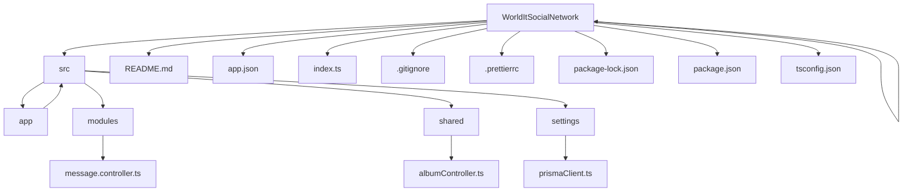

# WorldIT Social Network

## Описание проекта

Вставьте сюда описание своей социальной сети (у меня нет идей сейчас разливаться соловьем).

Придерживайтесь схемы: 
1. Что делает проект
2. Для кого он создан
3. В чем его уникальность для пользователя

## Функционал

Данное приложение ...

(Необходимо перечислить основные возможности приложения. То, что идет к разработчику -- ненада)

## Используемые технологии и стек

При разработке данного приложения были использованы такие языки программирования, фреймфорки, базы данных и библиотеки как:

- Название
- Название
- Название
- Название
- Название
- Название

## Figma

(Вставьте сюда свою ссылку на файл фигмы с дизайном)

## Как установить проект локально?

1. Склонируйте репозиторий, скопировав ссылку.
2. Создайте новый терминал.
3. Установите зависимости с помощью команды:
```
npm install
```
Ее необходимо ввести в строку терминала.
4. Запустите проект, введя в строку в терминале команду:
```
npm run start
```
5. (Если вдруг необъодимо установить какие-то настройк, подключение к API или базе данных)

## Структура проекта

```mermaid
graph TD
        Main[Chit-Chat-Back-End]-->
            Prisma[prisma]-->
                DataBase[db]-->Database.db
            Prisma[prisma]--> 
                Migrations[migrations]--> 2734923u590
                Migrations[migrations]--> migration_lock.toml

            Prisma[prisma]--> 
                Schema[schema]--> album.prisma
                Schema[schema]--> chats.prisma
                Schema[schema]--> friendship.prisma
                Schema[schema]--> images.prisma
                Schema[schema]--> post.prisma
                Schema[schema]--> user.prisma

            Prisma[prisma]--> schema.prisma
            Prisma[prisma]--> seed.ts

        Main[Chit-Chat-Back-End]-->
            Src[src]-->
                Chats[Chats]--> chat.controller.ts
                Chats[Chats]--> chat.repository.ts
                Chats[Chats]--> chat.router.ts
                Chats[Chats]--> chat.sevrice.ts
                Chats[Chats]--> chat.socket.controller.ts

            Src[src]-->
                Messages[Messages]--> message.controller.ts
                Messages[Messages]--> message.router.ts
                Messages[Messages]--> message.service.ts
                Messages[Messages]--> message.type.ts
                Messages[Messages]--> messages.repository.ts

            Src[src]-->
                albumApp[albumApp]--> albumController.ts
                albumApp[albumApp]--> albumResository.ts
                albumApp[albumApp]--> albumRouter.ts
                albumApp[albumApp]--> albumService.ts
                albumApp[albumApp]--> types.ts

            Src[src]-->client[client]-->prismaClient.ts

            Src[src]-->
                config[config]-->errorCodes.ts
                config[config]-->token.ts

            Src[src]-->
                friendshipApp[friendshipApp]-->friendshipController.ts
                friendshipApp[friendshipApp]-->friendshipRepository.ts
                friendshipApp[friendshipApp]-->friendshipRouter.ts
                friendshipApp[friendshipApp]-->friendshipService.ts
                friendshipApp[friendshipApp]-->types.ts

            Src[src]-->
                generated[generated]-->prisma

            Src[src]-->
                middlewares[middlewares]--> authTokenMiddleware.ts
                middlewares[middlewares]--> socketAuthMiddleware.ts

            Src[src]-->
                postApp[postApp]--> postController.ts
                postApp[postApp]--> postRepository.ts
                postApp[postApp]--> postRouter.ts
                postApp[postApp]--> postService.ts
                postApp[postApp]--> types.ts

            Src[src]-->
                types[types]--> socket.ts
                types[types]--> types.ts

            Src[src]-->
                userApp[userApp]--> types.ts
                userApp[userApp]--> userController.ts
                userApp[userApp]--> userRepository.ts
                userApp[userApp]--> userRouter.ts
                userApp[userApp]--> userService.ts

            Src[src]-->index.ts

            Src[src]-->socket.ts

        Main[Chit-Chat-Back-End]-->Utils[utils]-->fileUtils.ts

        Main[Chit-Chat-Back-End]-->Gitignore[.gitignore]

        Main[Chit-Chat-Back-End]-->Prittier[.prettierrc]

        Main[Chit-Chat-Back-End]-->PackageLock[package-lock.json]

        Main[Chit-Chat-Back-End]-->Package[package.json]

        Main[Chit-Chat-Back-End]-->Tscofig[tsconfig.json]
```




## Отображение приложения

(Вставьте сюда изображения-скриншоты приложения и его работы)

## Команда розробки

- Єгор Гончаров - [GitHub](https://github.com/YehorHoncharov)
- Семен Гераймович - [GitHub](https://github.com/arman455)
- Богдан Рубанов - [GitHub](https://github.com/BohdanRubanov)